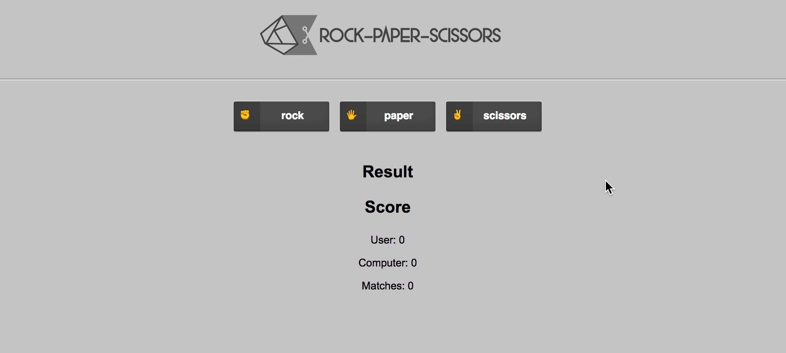

<p align="center">
  


---

[](LICENSE.md) [](https://travis-ci.org/edson-junior/rock-paper-scissors) [](https://coveralls.io/github/edson-junior/rock-paper-scissors?branch=master)



> ✂️ A yet another rock, paper, scissors game

## The rules:

- Scissors beats Paper
- Rock beat Scissors
- Paper beats Rock
- If both players choose the same, the round is counted as a tie.
- Player A (Computer) chooses randomly
- Player B (Human) chooses normally

### How to Run

1. Install the dependencies: ``` npm i ```
2. Run application: ``` npm run dev ```

## Running the tests

You can run the Unit tests by typing:
```
npm run test
```

## Contributing

Please read [CONTRIBUTING.md](CONTRIBUTING.md) for details on our code of conduct, and the process for submitting pull requests to us.

## Authors

* [Edson Junior](https://github.com/edson-junior)

See also the list of [contributors](https://github.com/edson-junior/rock-paper-scissors/contributors) who participated in this project.

## License

This project is licensed under the MIT License - see the [LICENSE.md](LICENSE.md) file for details

## Acknowledgments

* [Nuno Jesus](https://github.com/nunojesus) for designing the beautiful logo
